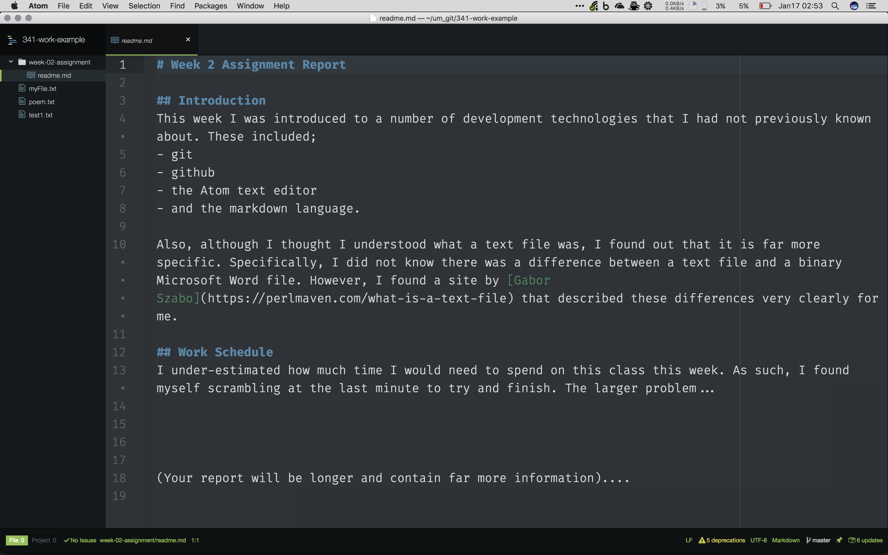

# Week 2 Assignment Report

## Introduction
This week I was introduced to a number of development technologies that I had not previously known about. These included;
- git
- github
- the Atom text editor
- and the markdown language.

Also, although I thought I understood what a text file was, I found out that it is far more specific. Specifically, I did not know there was a difference between a text file and a binary Microsoft Word file. However, I found a site by [Gabor Szabo](https://perlmaven.com/what-is-a-text-file) that described these differences very clearly for me.

Finally, I did enjoy setting up my text editor this week and am happy with the color theme I found to work with.

## Work Schedule
I under-estimated how much time I would need to spend on this class this week. As such, I found myself scrambling at the last minute to try and finish. The larger problem...

(Your report will be longer and contain far more information)....
